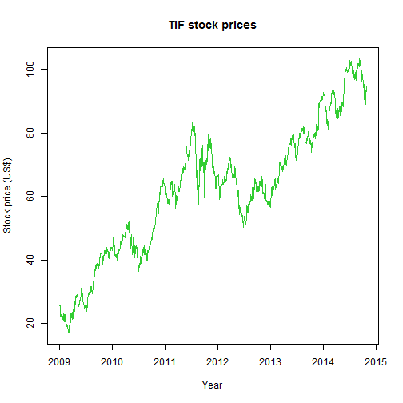

optPricer
========================================================
author: Gabriel Simmonds
date: 24th October 2014
transition: fade
transition-speed: slow
height: 900
width: 2000


Slide 2: Background
========================================================
The Black-Scholes model gives the price of Put or Call options with the following
equations. We shall use these in the optPricer option pricing app:

$\huge{P=N(-d_2)Ke^{-r_f(T-t)}-N(-d_1)S}$  
$\huge{C=N(d_1)S-N(d_2)Ke^{-r_f(T-t)}}$

<small>where</small>

$\huge{d_1=[ln(S/K)+(r_f + \sigma^2/2).(T-t)]/(\sigma\sqrt{T-t})}$  
$\huge{d_2=[ln(S/K)+(r_f - \sigma^2/2).(T-t)]/(\sigma\sqrt{T-t})}$

<small>and</small>

$\huge{N()}$ is the cumulative distribution function  
$\huge{S}$ is the spot price of the relevant stock at the analysis date  
$\huge{K}$ is the strike price of the option  
$\huge{(T-t)}$ is the time between expiry date of the option and analysis date in years  
$\huge{\sigma}$ is the volatility of the option price returns  
$\huge{r_f}$ is the risk-free interest rate at the analysis date


Slide 3: Definition of variables
========================================================
The 'optPricer' shiny app uses the formulas defined in the previous slide to calculate the price of an option
 
For our illustrative example, we have chosen Tiffany (TIF) as the company

The analysis date (t) is set as 2013-10-14

The expiry date (T) is set as 2014-10-14

The spot price on the analysis date (S) is set to 76.46

The strike price (K) will be 81.50

Our risk-free interest rate (rf) is 3.5% = 0.035

We choose the option type (OT) as a "Put"


Slide 4: Stock price time-series plot
========================================================
<small>Just as in the optPricer shiny app, with the code below, we download a stock price time-series for Tiffany (TIF) from finance.yahoo.com  
We read the data into a dataframe, set the Date column of the dataframe to be a date variable, and then plot out the closing prices against the date.  
This time-series dataframe is read into the program in Slide 5 along with details of the option from Slide 3 in order to derive an option price, just as occurs in the optPricer shiny app.</small>

```r
fileURL <- "http://real-chart.finance.yahoo.com/table.csv?s=TIF&a=00&b=1&c=2009&d=10&e=14&f=2014&g=d&ignore=.csv"
priceData <- read.table(fileURL, header = TRUE, sep = ",")
priceData$Date <- as.Date(priceData$Date)
plot(priceData$Date, priceData$Close, type = "l", col = "limegreen", 
     main = "TIF stock prices", xlab = "Year", ylab = "Stock price (US$)")
```

 


Slide 5: Result of option price calculation
========================================================

```r
t <- as.Date("2013-10-14"); T <- as.Date("2014-10-14")
S <- 76.46; K <- 81.50; rf <- 0.035; OT <- "Put"
pricerFn <- function(t, T, K, rf, OT) {
			yDiff <- as.numeric(as.Date(T) - as.Date(t)) / 365
			previousPrices <- priceData[priceData$Date <= as.Date(t) & priceData$Date > (as.Date(t) - 365), ]$Close
			sigma <- sd(returns <- (-1 * diff(previousPrices))/tail(previousPrices, -1))
			d1 <- (log(S / K) + ((rf + (0.5 * (sigma ^ 2))) * yDiff)) / (sigma * (yDiff ^ 0.5))
			d2 <- d1 - (sigma * (yDiff ^ 0.5))
			priceP <- (pnorm(-d2) * K * exp(-rf * yDiff)) - (pnorm(-d1) * S)
			priceC <- (pnorm(d1) * S) - (pnorm(d2) * K * exp(-rf * yDiff))
			if(OT == "Put") {
				priceP
			} else {
				priceC
			}
            }
paste("Price of ", OT, " option is US$ ", round(pricerFn(t, T, K, rf, OT), digits = 6), sep = "")
```

```
[1] "Price of Put option is US$ 2.247172"
```
